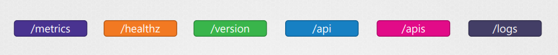
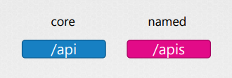
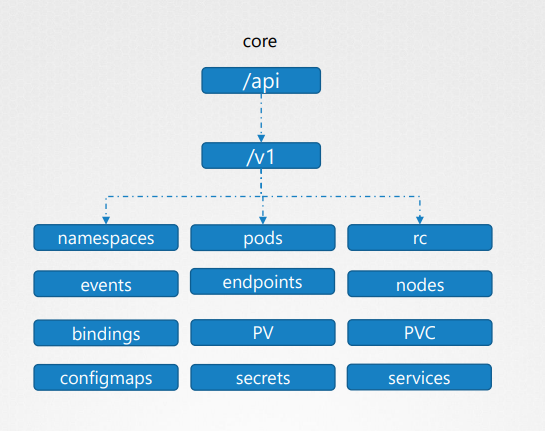
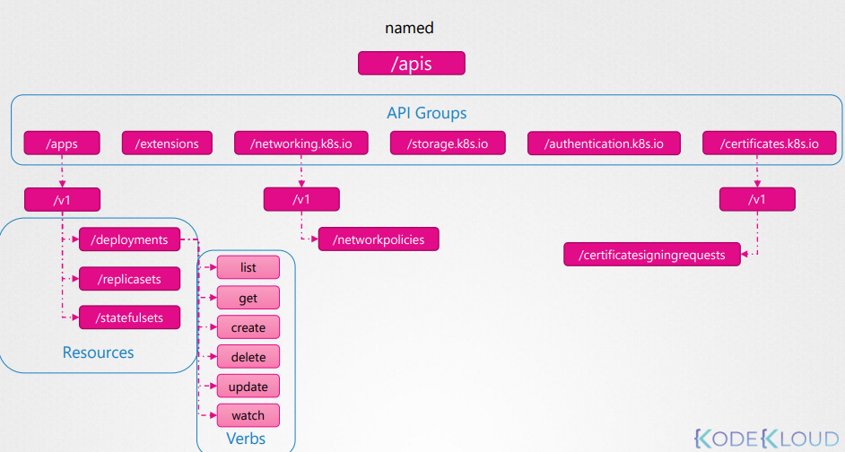

# API Groups

The Kubernetes serves multiple API, each one is composed of multiple API Groups.

## APIs

The **core** and **named** apis are those we use the most for building our objects.

## Core API

This is where all core functionalities exist.

## Named API

The named group is where all newer features are going to be made available.

The picture below shows some of the main (not all) groups of the named API.

Each *group* has a set of **resources** associated.

Each *resource* has a set of **verbs** associated.