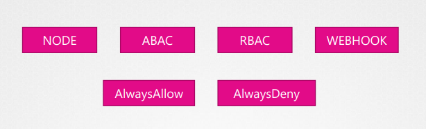

# Authorization

Kubernetes comes with multiple ways to handle authorization.

## Node authorizer

Manages authorization inside the cluster for the system:node group.

## ABAC

Attribute-based access control is made for external users. Policies are defined per-user and defined in a JSON format.

A per-user authorization process is hard to maintain. Also it requires the restart of the apiServer so ABAC is too hard to manage.

## RBAC

Role-base access control is the preferred way of managing authorization for external users as well as for service accounts.

Permissions are grouped into a **Role** and Users are associated to these Roles.

## Webhooks

Webhooks are a way make access control managed by a 3rd party application.

## Authorization modes



By default the authorization mode is *AlwaysAllow*.

The authorization modes are passed during the apiServer startup.

```
--authorization-mode=Node,RBAC,Webhook
```

The authorization are evaluated in the order they are listed. 

In our example Node -> RBAC -> Webhook.

The authorization is evaluated until it is successfully authorized. If an authorization is denied, the request is passed to the next mode.
