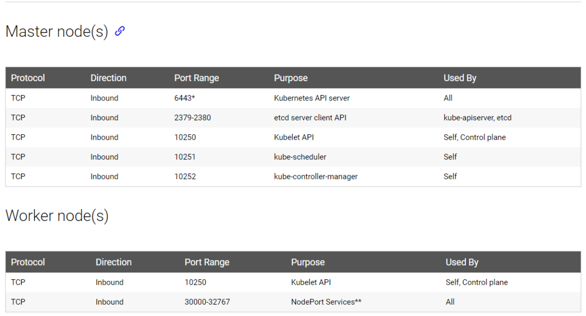

# Networking Configuration

## Nodes

Each node must have at least one interface connected to a network.

Each interface must have an IP address configured.

Hosts must have a unique hostname and a unique MAC address.

## Ports

https://kubernetes.io/docs/setup/independent/install-kubeadm/#check-required-ports

If we have multiple master nodes, port 2380 needs to be opened to allow ETCD clients to communicate.

